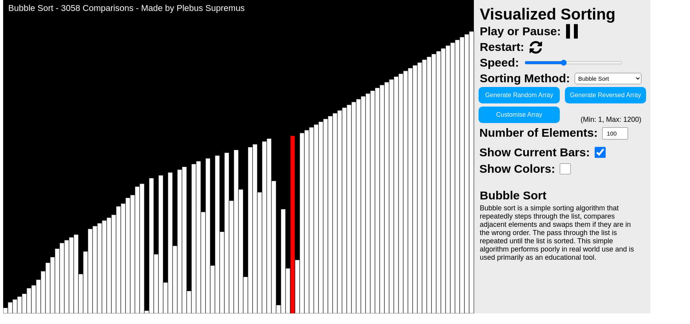
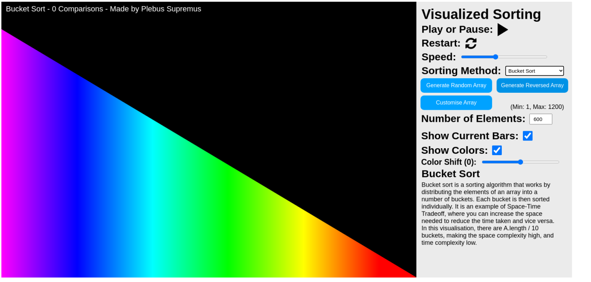
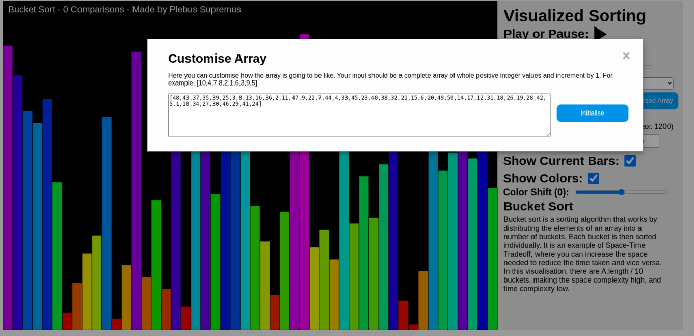

# Visualized-Sorting
A visualisation of different sorting methods such as Bubble, Selection, Insertion, Bucket, Cocktail Shaker, Merge and Quick Sort.

## See how different sort algorithms work
Bubble Sort | Quick Sort
:-------------------------:|:-------------------------:
 | 

## Set the initial array to a special order
Reversed | Custom
:-------------------------:|:-------------------------:
 | 